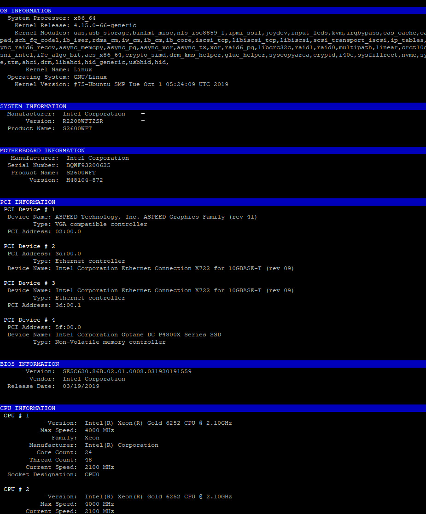

# GetSystemInfo
Parse information about Hardware and Software present in a system running Linux

To run this tool simply run
`./GetSystemInfo.pl`

This is a sample of some of the information that GetSystemInfo displays:

